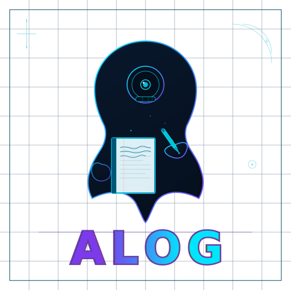

<p align="center">
  <strong>A notebook for your agents.</strong> <br>
  Help with memory, recall, and predictable workflows. <br>
  Journaling is good for your agents' mental health.
  <br>
  <br>
  
</p>

---

# What is alog?

`alog` is a CLI logbook for AI agents. Agents write notes during a session — bugs found, patterns observed, approaches that worked or failed — and recall them in future sessions using fuzzy search. It gives agents a persistent memory that survives context resets.

Notes are stored as local JSON files. No server, no account, no dependencies.

## Usage

**Write a note:**
```bash
alog write bugfix "tokio runtime panicked — was calling .unwrap() on a blocking read inside async fn. Fix: use tokio::task::spawn_blocking." --project=myapi
```

**Recall notes:**
```bash
alog recall bugfix "tokio panic" --project=myapi
alog recall all "authentication" --project=myapi --count=5 --threshold=70
```

**Replace a stale note** (id is returned by `alog recall`):
```bash
alog write decisions "switched from sqlx to diesel — better compile-time guarantees" --project=myapi --replace=abc123
```

## Categories

| Category | Use for |
|----------|---------|
| `bugfix` | Root cause and fix for a bug |
| `whatworks` | Approaches and patterns that succeeded |
| `problems` | Dead ends and failures |
| `patterns` | Recurring code idioms in a codebase |
| `decisions` | Architectural decisions and rationale |
| `warnings` | Gotchas and sharp edges |
| `deps` | Dependency quirks and version notes |
| `perf` | Performance findings |
| `tests` | Testing patterns and structure |
| `setup` | Environment and toolchain notes |

## Claude Code Skills Integration

`alog` ships with a Claude Code skill at `.claude/skills/alog.md`. When this skill is active, Claude automatically:

- recalls relevant notes **before** starting non-trivial tasks
- writes notes **after** fixing bugs, making decisions, or hitting dead ends
- scopes all notes to the current repo using `--project=<git-root-name>`

The skill gives Claude a persistent working memory across sessions without any manual prompting.

## Storage

```
$HOME/.alog/
  config.json
  logbook/
    global/
      <category>.json
    <projectname>/
      <category>.json
```

Per-repo config lives at `GITROOT/.alog.json`.

## Getting Started

See **[docs/getting-started.md](docs/getting-started.md)** for installation, build instructions, and a walkthrough.