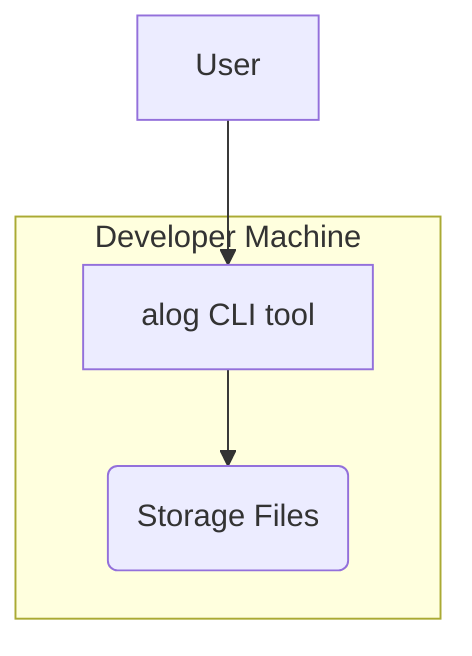

# Project Architecture

Pattern: single statically-linked binary

## Design Principles

### Principle 1
Description:
- simplicity over conciseness
Reasoning:
- intermediate developers should feel at home in this codebase

### Principle 2
Description:
- layered testing
Reasoning:
- by combining layers of unit tests, integration tests, and end-to-end tests, maximal test coverage can be achieved

## High-level Architecture:

## Major Components

### Component 1:
Name: alog CLI
Purpose: allow an AI agent to create and recall notes about what they work on efficiently.
Description and Scope:
- description: a CLI tool which stores lightly-structured notes persistently for future recall.
- scope: a single CLI binary which interacts with files used to store and recall lightly-structured notes.